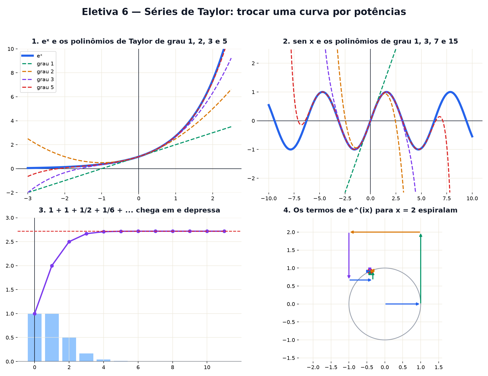

# Eletiva 6 — Séries de Taylor: trocar uma curva por potências

> Estas são as notas em texto da aula. A versão interativa, com os laboratórios e os exercícios
> que se corrigem sozinhos, está em [`index.html`](index.html).

*A calculadora não sabe o que é seno. Ela só sabe somar e multiplicar. Mesmo assim devolve sen(1)
com dez casas certas — trocando a curva por um polinômio que a imita.*

**Você já sabe:** polinômios (Aula 13), o número e (Aula 14), seno e cosseno (Aula 15), números
complexos e eiθ (Aula 18), a derivada e a reta tangente (Aula 19). Uma série de Taylor é a reta
tangente levada até o fim.

Polinômios são as funções mais fáceis do mundo: só somas e multiplicações. A ideia de Brook Taylor
(1715) é imitar qualquer função "lisa" por um polinômio, casando com ela em um ponto: o mesmo valor,
a mesma inclinação, a mesma curvatura, e assim por diante. Quanto mais derivadas combinam, melhor a
imitação — e, para muitas funções, a imitação fica perfeita.

> **🧠 Poder do cérebro**
>
> Perto de x = 0, a reta tangente de `eˣ` é `1 + x` (Aula 19). Ela erra quando x cresce, porque eˣ
> curva para cima. Que termo você somaria à reta para imitar essa curvatura?
>
> **Resposta:** Um termo com x², que é o que curva: `1 + x + x²/2`. O 1/2 vem de casar a curvatura:
> a segunda derivada de eˣ em 0 é 1, e a de `c · x²` é `2c`, então c = 1/2. Continuando: `+ x³/6 +
> x⁴/24 + ...` — os denominadores são 1, 2, 6, 24: os fatoriais.

---

## Uma curva feita de potências

A **série de Taylor** de f em volta de 0 é

`f(x) ≈ f(0) + f′(0) · x + f″(0) · x²/2! + f‴(0) · x³/3! + ...`

Para eˣ, todas as derivadas valem 1 em 0: `eˣ = 1 + x + x²/2! + x³/3! + ...`. O **grau** é quantos
termos você guarda.

> 🔧 **Laboratório — imitando eˣ.** Aumente o grau do polinômio (roxo) e veja ele colar na curva de
> verdade (azul), a partir do centro. *(interativo, na versão em HTML)*

**✅ Por que é verdade? De onde vem o k! no denominador**

1. Queremos `p(x) = c₀ + c₁x + c₂x² + c₃x³ + ...` com as mesmas derivadas de f em 0.
2. Em x = 0, só sobrevive o termo sem x: `p(0) = c₀`. Derivando uma vez (Aula 19), `p′(0) = c₁`.
   Duas vezes: `x² → 2x → 2`, então `p″(0) = 2 · c₂`.
3. k vezes: `xᵏ` vira `k · (k − 1) ··· 1 = k!`, e os outros termos somem. Então `p⁽ᵏ⁾(0) = k! · cₖ`.
4. Para casar com f: `cₖ = f⁽ᵏ⁾(0) / k!`. ∎

---

## O seno de uma calculadora

As derivadas de sen x em 0 repetem `0, 1, 0, −1, ...` (Aula 19). Sobram só as potências ímpares, com
sinais alternados:

`sen x = x − x³/3! + x⁵/5! − x⁷/7! + ...`

Poucos termos já acertam perto de 0; para ângulos grandes, a calculadora primeiro usa a
periodicidade (Aula 16) para trazer o ângulo para perto de 0.

> 🔧 **Laboratório — polinômios que ondulam.** Cada termo a mais estende a região em que o polinômio
> acompanha a onda. *(interativo, na versão em HTML)*

---

## Calculando o número e

Com x = 1, a série de eˣ vira uma receita para o próprio e: `e = 1 + 1 + 1/2 + 1/6 + 1/24 + ...` Os
fatoriais crescem tão depressa que cada termo é bem menor que o anterior, e a soma se estabiliza
rapidíssimo — muito mais depressa que os juros compostos da Aula 14.

> 🔧 **Laboratório — somando 1/k!** Cada barra é um termo 1/k!. A linha mostra a soma acumulada
> chegando em e. *(interativo, na versão em HTML)*

> 🧘 **O Guru:** Uma função complicada, olhada de perto, é quase uma reta. Olhada um pouco menos de
> perto, quase uma parábola. Taylor só teve a paciência de não parar. Quase todo problema difícil
> vira fácil se você se contentar em entendê-lo perto de um ponto — e souber até onde vale esse
> perto.

---

## Até onde a série funciona

Nem toda série imita a função em todo lugar. A mais simples de todas é a **geométrica**:

`1 / (1 − x) = 1 + x + x² + x³ + ...`

Com x = 0,5, os termos encolhem e a soma chega em 2. Com x = 2, os termos crescem e a soma explode —
mesmo a função valendo −1 ali. A série só funciona dentro do **raio de convergência** (aqui, |x| <
1): a distância do centro até o primeiro lugar onde a função "quebra" (x = 1, divisão por zero).

> 🔧 **Laboratório — converge ou explode?** Escolha x. As barras são as somas parciais 1, 1 + x, 1 +
> x + x², ...; a linha tracejada é o valor verdadeiro de 1/(1 − x). *(interativo, na versão em
> HTML)*

---

## Mudando o centro

A série pode ser montada em volta de qualquer ponto a: `f(a) + f′(a)(x − a) + f″(a)(x − a)²/2! +
...`. Isso importa quando a função quebra em algum lugar. O logaritmo `ln x` quebra em x = 0; em
volta de a, a série funciona só até a distância a — até `2a` do outro lado. Mova o centro e veja o
raio acompanhar.

> 🔧 **Laboratório — o logaritmo em volta de a.** Polinômio de grau 12 para ln x, centrado em a. A
> faixa verde é a região de convergência (de 0 até 2a). *(interativo, na versão em HTML)*

> **⚠️ Cuidado — polinômio de Taylor é aproximação local**
>
> Ele é ótimo perto do centro e pode ser péssimo longe. Fora do raio de convergência, somar mais
> termos **piora** em vez de melhorar. E mesmo dentro, truncar deixa um erro: para séries alternadas
> como a do seno, o erro é menor que o primeiro termo desprezado — é assim que se garante quantas
> casas estão certas.

---

## A série que junta tudo: eix

Ponha `ix` na série de eˣ e separe os termos com e sem i (lembrando que `i² = −1`, Aula 18). Os
termos sem i formam exatamente a série do cosseno; os com i, a do seno:

`eix = cos x + i · sen x`

No plano complexo, cada termo é uma seta que gira 90° em relação à anterior e encolhe. Encaixadas
ponta com cauda, elas espiralam até um ponto do círculo de raio 1.

> 🔧 **Laboratório — a espiral de Euler.** Cada seta é um termo `(ix)ᵏ/k!`. O ponto vermelho é o
> alvo: `cos x + i · sen x`. *(interativo, na versão em HTML)*

### Não existe pergunta idiota

**P:** Toda função tem série de Taylor que funciona?

**R:** Não. Há funções lisas (com infinitas derivadas) cuja série existe mas não converge para elas
— o exemplo clássico é `e−1/x²`, que tem todas as derivadas nulas em 0 e, mesmo assim, não é zero.
As que são iguais à própria série se chamam **analíticas**: polinômios, eˣ, seno, cosseno e quase
tudo que aparece na física.

**P:** Isso é usado fora da calculadora?

**R:** O tempo todo. Físicos trocam funções complicadas pelos primeiros termos da série ("para
ângulos pequenos, sen θ ≈ θ" — é a conta do pêndulo), e engenheiros estimam erros do mesmo jeito.

---

## Pontos importantes

- **Série de Taylor**: `Σ f⁽ᵏ⁾(a) (x − a)ᵏ / k!` — casa todas as derivadas no centro.
- `eˣ = Σ xᵏ/k!`; `sen x = x − x³/3! + ...`; `e = Σ 1/k!`.
- O k! vem de derivar xᵏ k vezes.
- **Raio de convergência**: até onde a série funciona; geométrica: |x| < 1.
- `eix = cos x + i sen x` sai direto das séries.

---

## ✏️ Afie o lápis

1. A aproximação de grau 1 de `eˣ` em volta de 0 é `1 + x`. Quanto ela dá para x = 0,1? → **1,1**
2. Na série de eˣ, o termo de grau 4 é `x⁴ / 4!`. Quanto vale 4!? → **24**
3. Por que a série do seno em volta de 0 só tem potências ímpares de x? → **Porque as derivadas
   pares do seno valem 0 em x = 0 (sen 0 = 0, −sen 0 = 0, ...).**
4. O que acontece com `1 + x + x² + x³ + ...` para x = 2? → **Explode: x = 2 está fora do raio de
   convergência (|x| < 1).**
5. *(o desafio)* Use a série geométrica com x = 1/2: quanto vale `1 + 1/2 + 1/4 + 1/8 + ...`
   (infinitos termos)? → **2**
6. *(quem faz o quê?)* Ligue cada peça ao seu papel. → **série de Taylor → soma de potências que
   imita a função; raio de convergência → até onde a série funciona; k! → o que divide o termo de
   grau k; grau do polinômio → quantos termos você guardou**
