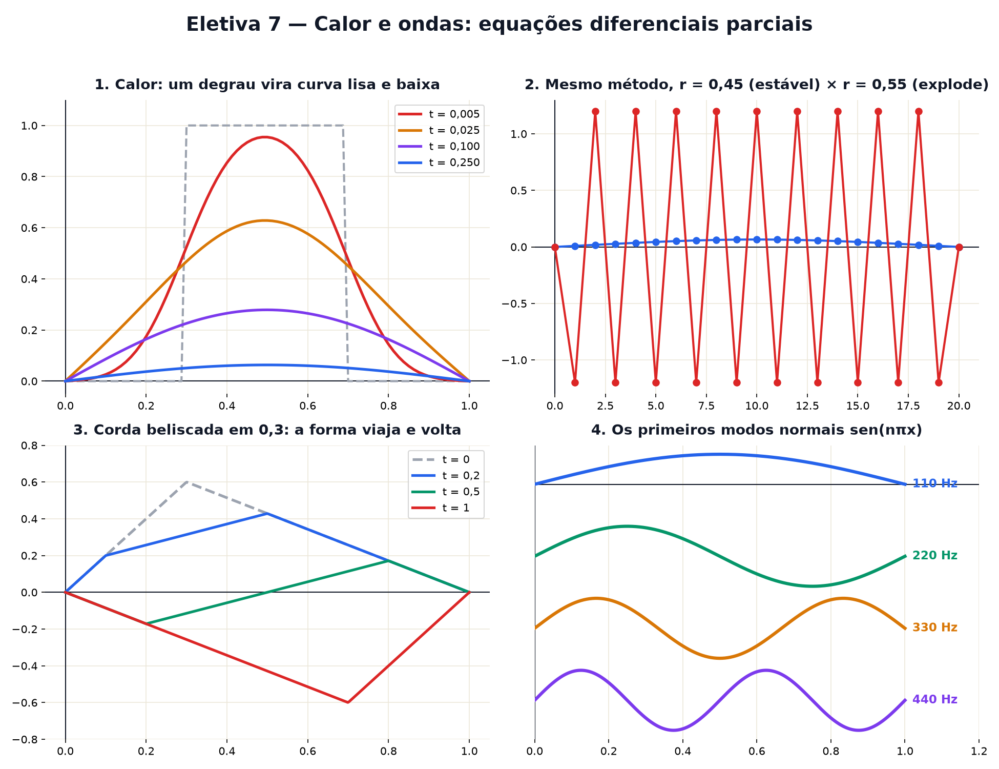

# Eletiva 7 — Calor e ondas: equações diferenciais parciais

> Estas são as notas em texto da aula. A versão interativa, com os laboratórios e os exercícios
> que se corrigem sozinhos, está em [`index.html`](index.html).

*Uma barra de ferro esfriando e uma corda de violão vibrando obedecem a equações parecidas — mas uma
alisa tudo e a outra carrega o desenho para longe. Hoje você simula as duas.*

**Você já sabe:** ondas (Aula 16), a integral (Aula 20), Fourier: decompor em senos (Aula 24) e o
método de Euler, andar em passinhos (Aula 28). Uma EDP é Euler aplicado em cada ponto ao mesmo
tempo.

Na Aula 28, a incógnita era uma curva no tempo: y(t). Agora é um **perfil inteiro** que muda no
tempo: a temperatura u(x, t) em cada ponto x da barra, a cada instante t. A regra fala de derivadas
em t *e* em x — daí o nome **equação diferencial parcial** (EDP). Calor, som, luz, ondas do mar,
preços de opções: quase toda a física é escrita assim.

> **🧠 Poder do cérebro**
>
> Uma barra de metal tem a parte do meio quente e as pontas frias. Imagine um pedacinho da barra e
> os dois vizinhos dele. O que decide se esse pedacinho vai esquentar ou esfriar no próximo segundo?
>
> **Resposta:** Comparar com os vizinhos: se ele está mais frio que a **média** dos dois, recebe
> calor e esquenta; se está mais quente, perde calor. Essa comparação com a média dos vizinhos é,
> disfarçada, a segunda derivada em x. A equação do calor diz exatamente isso: `∂u/∂t = k ·
> ∂²u/∂x²`.

---

## A barra que esfria

Divida a barra em pedacinhos. A cada passinho de tempo, cada pedacinho anda um pouco em direção à
média dos vizinhos (Euler da Aula 28, em todos os pontos de uma vez):

`u novo = u + r · (u da esquerda − 2u + u da direita)`

As pontas estão encostadas no gelo (temperatura 0 fixa): é a **condição de contorno**. Qualquer
perfil de temperatura, com o tempo, fica suave, baixo e, no fim, some.

> 🔧 **Laboratório — a barra que esfria.** Escolha o perfil inicial e avance o tempo. O tracejado é o
> começo. *(interativo, na versão em HTML)*

**✅ Por que é verdade? "Comparar com a média dos vizinhos" é a segunda derivada**

1. Olhe o ponto x e os vizinhos a uma distância h. A inclinação à direita é ≈ `(u(x + h) − u(x)) /
   h`; à esquerda, ≈ `(u(x) − u(x − h)) / h` (Aula 19).
2. A segunda derivada é quanto a inclinação muda: `[(u(x + h) − u(x)) − (u(x) − u(x − h))] / h² =
   (u(x − h) − 2u(x) + u(x + h)) / h²`.
3. O numerador é o dobro de "média dos vizinhos menos o ponto". Então `∂²u/∂x² > 0` quer dizer
   "estou abaixo da média dos vizinhos" — e o calor me esquenta. ∎

---

## O passo que explode

O número `r = k · Δt / Δx²` diz quão grande é cada passinho de tempo comparado ao tamanho dos
pedacinhos. Se r passa de 1/2, a regra manda cada ponto "passar do alvo": ele pula para além da
média, os vizinhos pulam de volta, e um zigue-zague cresce sem parar — o mesmo "passo grande engana"
da Aula 28, agora com consequências dramáticas.

> 🔧 **Laboratório — estável ou instável?** Mesma barra, mesmo pico inicial, 20 pedacinhos. Mude r e
> o número de passos. *(interativo, na versão em HTML)*

---

## Fourier resolve o calor

Fourier inventou a análise da Aula 24 **justamente** para resolver esta equação (1807). O truque:
cada seno `sen(kπx)` não muda de forma com o calor, só encolhe — e encolhe na velocidade `e−(kπ)²t`.
Decomponha o perfil inicial em senos, deixe cada um encolher, e some de novo. As ondas rápidas (k
grande) morrem primeiro: por isso o calor alisa.

> 🔧 **Laboratório — cada seno encolhe no seu ritmo.** Perfil inicial: um degrau (quente no meio).
> Barras: o tamanho de cada seno. Curva: a soma. *(interativo, na versão em HTML)*

> 🧘 **O Guru:** O calor esquece: qualquer desenho, com o tempo, vira uma curva lisa e depois nada. A
> onda lembra: carrega a forma inteira para longe e a devolve. Duas equações quase iguais, dois
> destinos opostos — só por causa de uma derivada a mais no tempo. Detalhes pequenos nas regras
> fazem mundos diferentes.

---

## A corda que vibra

Numa corda esticada, a regra fala da **aceleração** (Aula 28, a mola): cada pedacinho é puxado para
a média dos vizinhos. A **equação da onda** é

`∂²u/∂t² = c² · ∂²u/∂x²`

Parece a do calor — só trocou a primeira derivada no tempo pela segunda. E muda tudo: nada alisa,
nada some. A forma inicial viaja, bate nas pontas e volta, para sempre (sem atrito).

> 🔧 **Laboratório — belisque a corda.** Escolha onde beliscar e avance o tempo. Um período completo
> leva 2 unidades de tempo. *(interativo, na versão em HTML)*

---

## O pulso que se divide

D'Alembert (1747) achou a solução geral da onda: `u(x, t) = F(x − ct) + G(x + ct)` — uma forma
andando para a direita e outra para a esquerda, sem se deformar (a mesma ideia de deslocar da Aula
13). Um pulso parado se divide em dois meio-pulsos que se afastam; numa ponta presa, cada um volta
de cabeça para baixo.

> 🔧 **Laboratório — o pulso que se divide.** Um calombo no meio da corda, solto em repouso. Avance o
> tempo. *(interativo, na versão em HTML)*

> **⚠️ Cuidado — simulação de EDP tem regra de trânsito**
>
> Nos métodos simples (como o da barra), o passo de tempo não é livre: no calor é preciso `r =
> kΔt/Δx² ≤ 1/2`; na onda, `cΔt ≤ Δx` (a condição de Courant–Friedrichs–Lewy: a simulação não pode
> ser mais lenta que a própria onda). E repare no quadrado: dividir os pedacinhos pela metade obriga
> a dividir o passo de tempo por 4.

---

## Os harmônicos da corda

Alguns formatos vibram sem mudar de forma, só subindo e descendo: os **modos normais** `sen(nπx)`,
as mesmas ondas de Fourier. O modo n vibra n vezes mais rápido que o primeiro. É a **série
harmônica** da música: uma corda afinada em lá (110 Hz) também soa 220, 330, 440 Hz... e a mistura
desses harmônicos é o timbre do violão.

> 🔧 **Laboratório — os modos normais.** Escolha o modo e avance o tempo. Os pontos pretos (nós)
> nunca se mexem. *(interativo, na versão em HTML)*

### Não existe pergunta idiota

**P:** E em duas ou três dimensões?

**R:** É igual, trocando "média dos 2 vizinhos" por "média dos 4 (ou 6) vizinhos". O calor numa
chapa, a água numa piscina e o som numa sala são simulados assim — o mesmo código dos videogames que
mostram água e fumaça.

**P:** A previsão do tempo é isso?

**R:** É: equações parciais do ar (as de Navier–Stokes), resolvidas em milhões de pedacinhos com
passos pequenos. E um dos problemas do milênio, com prêmio de um milhão de dólares, é provar se
essas equações sempre têm solução lisa.

---

## Pontos importantes

- **EDP**: a incógnita é um perfil u(x, t); aparecem derivadas em x e em t.
- **Calor**: `∂u/∂t = k ∂²u/∂x²` — cada ponto anda para a média dos vizinhos; tudo alisa e decai.
- Fourier: cada seno decai como `e−(kπ)²t`; os rápidos somem primeiro.
- **Onda**: `∂²u/∂t² = c² ∂²u/∂x²` — formas viajam sem alisar (d'Alembert).
- **Modos normais** sen(nπx) vibram com frequência n vezes a fundamental. Estabilidade: `r ≤ 1/2`.

---

## ✏️ Afie o lápis

1. Na equação do calor, quando um ponto da barra esquenta? → **Quando ele está mais frio que a
   média dos vizinhos.**
2. Um ponto está a 12°; os vizinhos, a 10° e 30°. Com r = 0,25, qual é a temperatura dele depois
   de um passo? (Use `u + r · (esq − 2u + dir)`.) → **16**
3. Na solução de Fourier do calor, quais senos somem mais depressa? → **Os de frequência alta (k
   grande): encolhem como e−(kπ)²t.**
4. Uma corda tem frequência fundamental de 110 Hz. Qual é a frequência do terceiro modo normal
   (terceiro harmônico), em Hz? → **330**
5. *(o desafio)* Simulando o calor com k = 1 e pedacinhos de tamanho Δx = 0,1, qual é o **maior**
   passo de tempo Δt que ainda é estável (`r = kΔt/Δx² ≤ 1/2`)? → **0,005**
6. *(quem faz o quê?)* Ligue cada peça ao seu papel. → **equação do calor → espalha e alisa;
   equação da onda → transporta a forma sem alisar; condição de contorno → o que acontece nas
   pontas; modo normal → vibração com uma só frequência**
