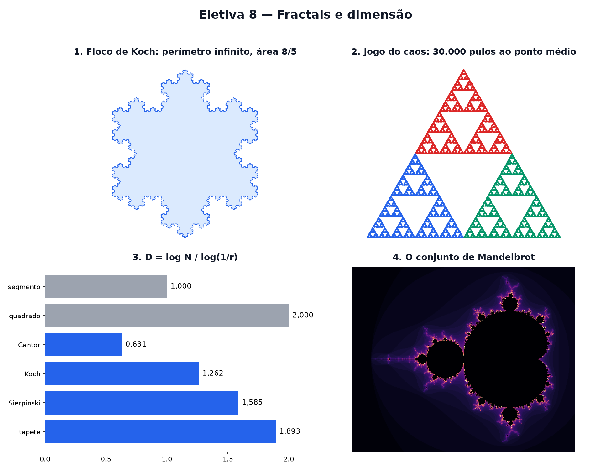

# Eletiva 8 — Fractais e dimensão

> Estas são as notas em texto da aula. A versão interativa, com os laboratórios e os exercícios
> que se corrigem sozinhos, está em [`index.html`](index.html).

*Uma curva de comprimento infinito que cabe numa folha. Um triângulo cheio de buracos. Uma forma de
dimensão 1,26. Os fractais quebram a geometria da escola — e descrevem costas, nuvens e árvores.*

**Você já sabe:** áreas (Aula 12), PG e logaritmos (Aula 14), transformações que encolhem e giram
(Aula 17), números complexos (Aula 18) e o acaso (Aula 6). Hoje eles desenham formas infinitamente
detalhadas.

Um **fractal** é uma forma que continua cheia de detalhe por mais que você dê zoom: cada pedacinho
lembra o todo. A natureza está cheia deles — o litoral, a couve-flor, os raios, os pulmões. E para
medi-los, a ideia de dimensão (1 para curvas, 2 para áreas) precisa ser reinventada: surgem
dimensões "quebradas", como 1,26.

> **🧠 Poder do cérebro**
>
> Qual o comprimento do litoral do Brasil? Pense: medindo com uma régua de 100 km, você pula as
> baías pequenas. Com uma de 1 km, entra nelas. Com uma de 1 metro, contorna cada pedra. O que
> acontece com o número conforme a régua diminui?
>
> **Resposta:** Ele cresce sem parar: a régua menor entra em reentrâncias que a maior pulava. O
> litoral não tem "um" comprimento — Mandelbrot mostrou em 1967 que a pergunta certa é **como** o
> comprimento cresce quando a régua encolhe. Essa taxa é a dimensão fractal.

---

## O floco de neve de Koch

Comece com um triângulo. Em cada lado, troque o terço do meio por uma "tenda" com dois lados do
mesmo tamanho. Repita em todos os lados novos, para sempre. Cada passo multiplica o comprimento por
`4/3`: depois de n passos, o perímetro é `3 · (4/3)ⁿ` — uma PG (Aula 14) que cresce sem limite. Mas
a figura nunca sai de um círculo em volta do triângulo.

> 🔧 **Laboratório — o floco de neve de Koch.** Aumente os passos e acompanhe o perímetro e a área.
> *(interativo, na versão em HTML)*

**✅ Por que é verdade? Perímetro infinito, área finita**

1. **Perímetro:** cada lado vira 4 lados de 1/3 do tamanho, então o total é multiplicado por 4/3 a
   cada passo: `3, 4, 16/3, 64/9, ...` Uma PG de razão maior que 1 cresce sem limite.
2. **Área:** no passo n, colam-se `3 · 4ⁿ⁻¹` triângulos novos, cada um com área `(1/9)ⁿ` da original
   (lado 1/3 → área 1/9, Aula 12). O acréscimo total é `(1/3) · [1 + 4/9 + (4/9)² + ...]` vezes a
   área inicial.
3. A série geométrica de razão 4/9 (menor que 1) converge para `1/(1 − 4/9) = 9/5` (Eletiva 6 ou
   Aula 14). Acréscimo: `(1/3) · 9/5 = 3/5`. Área final: `8/5` da inicial — finita. ∎

---

## O jogo do caos

Marque os três cantos de um triângulo e um ponto qualquer. Repita: sorteie um canto e pule para o
**ponto médio** entre você e ele. Marque. Parece que vai sair uma nuvem de pontos sem graça. Sai o
**triângulo de Sierpinski**, um triângulo feito de três cópias de si mesmo com metade do tamanho — e
buracos em todas as escalas.

> 🔧 **Laboratório — o jogo do caos.** Escolha quantos pulos dar. Cada ponto tem a cor do canto
> sorteado. *(interativo, na versão em HTML)*

---

## Dimensão por autossemelhança

Divida um segmento em 3 partes: saem 3 cópias com 1/3 do tamanho. Um quadrado: 9 cópias (3²). Um
cubo: 27 (3³). O expoente é a dimensão: `N = (1/r)ᴰ`, com N cópias de tamanho r. Usando o logaritmo
(Aula 14) para tirar o expoente:

`D = log N / log(1/r)`

A curva de Koch: 4 cópias de 1/3 → `D = log 4 / log 3 ≈ 1,26`. Mais que uma linha, menos que uma
área.

> 🔧 **Laboratório — calcule a dimensão.** Cada forma é feita de N cópias dela mesma, reduzidas pelo
> fator r. *(interativo, na versão em HTML)*

> 🧘 **O Guru:** Nuvens não são esferas, montanhas não são cones, e o raio não anda em linha reta.
> Mandelbrot passou a vida olhando para o que a geometria da escola chamava de 'irregular' — e achou
> ordem ali. Quando algo parece bagunçado demais para a matemática, talvez a matemática é que ainda
> não foi inventada.

---

## Contando caixas

E quando a forma não é feita de cópias perfeitas, como um litoral? Cubra-a com uma grade de
quadradinhos de lado s e conte quantos N(s) ela toca. Para uma curva comum, N cresce como `1/s`;
para uma área, como `1/s²`. Para um fractal, como `(1/s)ᴰ`. Num gráfico de log N contra log(1/s), os
pontos formam uma reta — e a inclinação é a dimensão (a reta dos mínimos quadrados da Aula 23).

> 🔧 **Laboratório — contagem de caixas na curva de Koch.** Diminua as caixas. À direita, cada
> tamanho vira um ponto; a inclinação estima D. *(interativo, na versão em HTML)*

---

## O conjunto de Mandelbrot

Escolha um número complexo c (Aula 18). Comece em `z = 0` e repita `z → z² + c`. Ou z fica preso
perto da origem para sempre, ou foge para o infinito (e, se passar de 2 em tamanho, foge com
certeza). O **conjunto de Mandelbrot** é a coleção dos c que ficam presos. A regra cabe numa linha;
a fronteira é infinitamente complicada.

> 🔧 **Laboratório — o conjunto de Mandelbrot.** Preto: c que não fugiu dentro do número de
> tentativas. As cores dizem quão depressa os outros fugiram. *(interativo, na versão em HTML)*

---

## A órbita de um ponto

Cada pixel da imagem acima esconde uma história: a sequência `0, c, c² + c, ...` Para c = −1 ela
pula entre 0 e −1 para sempre (preso). Para c = 1, dispara: 0, 1, 2, 5, 26... Perto da fronteira, a
órbita dá centenas de voltas antes de decidir — é aí que mora o detalhe infinito.

> 🔧 **Laboratório — siga a órbita de c.** Escolha c. Os pontos ligados são z₀, z₁, z₂, ... A sombra
> ao fundo é o conjunto de Mandelbrot. *(interativo, na versão em HTML)*

> **⚠️ Cuidado — "dimensão 1,26" não quer dizer "um pedaço e um quarto"**
>
> A dimensão fractal mede **como a quantidade cresce com o zoom**, não um tamanho. E os fractais da
> natureza só são autossemelhantes numa faixa de escalas: o litoral de verdade para de ter detalhe
> no tamanho dos grãos de areia. Na contagem de caixas, use só a faixa de tamanhos em que os pontos
> formam de fato uma reta.

### Não existe pergunta idiota

**P:** Para que servem fractais além de fazer figuras bonitas?

**R:** Antenas de celular em forma de fractal captam muitas frequências num espaço pequeno; a
compressão de imagens, a geração de montanhas e nuvens em filmes e games, e a análise de batimentos
cardíacos e de mercados usam ideias fractais.

**P:** O conjunto de Mandelbrot é mesmo infinitamente detalhado?

**R:** É: provou-se que a sua fronteira tem dimensão 2 — tão enrugada quanto uma curva pode ser. Por
mais que se dê zoom, aparecem espirais, cavalos-marinhos e cópias em miniatura do conjunto inteiro.

---

## Pontos importantes

- **Fractal**: detalhe em todas as escalas; cada parte lembra o todo (autossemelhança).
- Koch: perímetro `3 · (4/3)ⁿ → ∞`, área finita (8/5 da inicial).
- Dimensão de autossemelhança: `D = log N / log(1/r)`. Koch ≈ 1,26; Sierpinski ≈ 1,585.
- Contagem de caixas: inclinação de log N contra log(1/s).
- Mandelbrot: os c em que `z → z² + c`, a partir de 0, não foge.

---

## ✏️ Afie o lápis

1. O floco de Koch começa com um triângulo de lados 1 (perímetro 3). Qual é o perímetro depois de
   1 passo? → **4**
2. Dividindo o lado de um quadrado por 3, ele vira 9 quadradinhos. Pela fórmula `D = log N /
   log(1/r)`, qual é a dimensão do quadrado? → **2**
3. O triângulo de Sierpinski é feito de 3 cópias com metade do tamanho. A dimensão dele fica... →
   **Entre 1 e 2: log 3 / log 2 ≈ 1,585.**
4. O número c = 0 pertence ao conjunto de Mandelbrot? → **Sim: z → z² + 0 a partir de 0 fica em 0
   para sempre.**
5. *(o desafio)* O conjunto de Cantor: tire o terço do meio de um segmento, depois o terço do
   meio de cada pedaço, para sempre. Sobram 2 cópias com 1/3 do tamanho. Qual é a dimensão? (Use log
   2 ≈ 0,3010 e log 3 ≈ 0,4771; responda com 4 casas.) → **0,6309**
6. *(quem faz o quê?)* Ligue cada ideia ao que ela quer dizer. → **autossemelhança → cada pedaço
   é cópia reduzida do todo; dimensão fractal → log N / log(1/r); conjunto de Mandelbrot → os c em
   que z² + c não foge; jogo do caos → pontos ao acaso que desenham um fractal**
