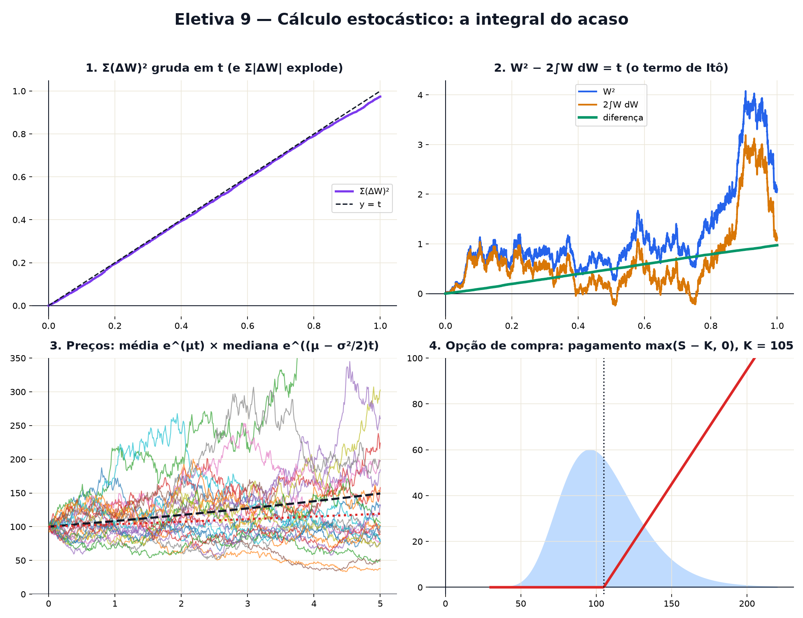

# Eletiva 9 — Cálculo estocástico: a integral do acaso

> Estas são as notas em texto da aula. A versão interativa, com os laboratórios e os exercícios
> que se corrigem sozinhos, está em [`index.html`](index.html).

*O movimento browniano é tremido demais para ter derivada. Mesmo assim, dá para somar com ele —
desde que você aceite uma regra nova e estranha: (dW)² = dt.*

**Você já sabe:** a integral como soma de fatias (Aula 20), a curva normal (Aula 21), o método de
Euler (Aula 28) e o passeio aleatório e o browniano, com espalhamento √t (Aula 29). Hoje eles viram
um cálculo novo.

Na Aula 29, o browniano W(t) apareceu como um passeio de passos minúsculos. Ele é contínuo, mas tão
tremido que não tem inclinação em lugar nenhum: a Aula 19 não consegue derivá-lo. Nos anos 1940,
Kiyosi Itô construiu um cálculo que funciona mesmo assim — e ele virou a língua da física
estatística, da biologia de populações e das finanças.

> **🧠 Poder do cérebro**
>
> Num intervalo de tempo dt, um passo comum anda algo proporcional a dt. O browniano anda algo da
> ordem de `√dt` (Aula 29). Se dt = 0,0001, quanto vale `dt²`? E `(√dt)²`? Qual dos dois dá para
> ignorar?
>
> **Resposta:** `dt² = 0,00000001`: desprezível, e é por isso que no cálculo comum os quadrados de
> passos somem. Mas `(√dt)² = dt = 0,0001`: do mesmo tamanho do passo! No mundo do browniano, o
> quadrado do passo **não** some — e somado ao longo do caminho dá o tempo inteiro. Esse é o coração
> do cálculo de Itô.

---

## Onde avaliar importa

Uma integral é uma soma de fatias (Aula 20). Para "integrar W contra W", some `W · ΔW` em pedacinhos
de tempo. Numa curva lisa, tanto faz usar o valor de W no começo ou no fim de cada pedacinho: as
duas somas chegam no mesmo número. Com o browniano, **não chegam** — a diferença entre elas é
exatamente `Σ(ΔW)²`, que não vai a zero. Itô escolheu o valor do **começo** (você não sabe o futuro
quando decide), e essa é a **integral de Itô**.

> 🔧 **Laboratório — soma pela esquerda × soma pela direita.** Mesmo caminho browniano, duas somas.
> Aumente o número de pedacinhos e veja se elas se encontram. *(interativo, na versão em HTML)*

---

## (dW)² = dt: a variação quadrática

Some os quadrados dos passos, `Σ(ΔW)²`, ao longo de um caminho até o tempo t. Numa curva lisa, isso
vai a zero quando os pedacinhos encolhem. No browniano, vai para **t** — e quase não depende do
sorteio. É a regra de bolso do cálculo estocástico: `(dW)² = dt`. Já a soma dos tamanhos `Σ|ΔW|`
explode: o caminho tem comprimento infinito.

> 🔧 **Laboratório — somando os quadrados dos passos.** A curva é a soma acumulada de (ΔW)²; a reta
> tracejada é y = t. *(interativo, na versão em HTML)*

**✅ Por que é verdade? Σ(ΔW)² chega em t**

1. Divida [0, t] em N pedacinhos de tamanho `Δt = t/N`. Cada passo ΔW é normal com média 0 e
   variância Δt (Aula 29): então a média de `(ΔW)²` é Δt.
2. Somando os N: a média de `Σ(ΔW)²` é `N · Δt = t`.
3. E o sorteio quase não muda o resultado: a variância de cada `(ΔW)²` é `2Δt²`; como os passos são
   independentes, a da soma é `2NΔt² = 2t²/N`, que vai a zero.
4. Média t e espalhamento sumindo: a soma crava em t. ∎

> 🧘 **O Guru:** No cálculo de Newton, os pedacinhos ao quadrado somem. No cálculo de Itô, eles se
> juntam e viram o próprio tempo. Um detalhe que todo mundo jogava fora virou uma teoria inteira.
> Antes de desprezar um termo, pergunte de que tamanho ele é — de verdade.

---

## O lema de Itô: a regra da cadeia com um termo a mais

No cálculo comum, `d(x²) = 2x dx`. Com o browniano, a expansão de Taylor (Eletiva 6) deixa sobrar o
termo quadrático, porque `(dW)² = dt`:

`d(W²) = 2W dW + dt · em geral: df(W) = f′(W) dW + ½ f″(W) dt`

Ou seja, `W(t)² = 2∫W dW + t`: o quadrado do browniano é a integral de Itô **mais** o tempo. O "+ t"
não existe no cálculo da escola.

> 🔧 **Laboratório — conferindo o lema de Itô.** Azul: W(t)². Laranja: 2∫W dW (soma de Itô). Verde: a
> diferença entre os dois — compare com a reta y = t. *(interativo, na versão em HTML)*

---

## O preço que passeia

O modelo clássico de preço de ação é o **movimento browniano geométrico**: o retorno (a variação
relativa) é tendência mais ruído,

`dS = μ · S · dt + σ · S · dW`

(é o "tendência + ruído" da Aula 29, agora em porcentagem). Aplicando Itô ao logaritmo, sai a
solução exata `S(t) = S₀ · e(μ − σ²/2)t + σW(t)`. Repare no `− σ²/2`: o termo de Itô. A média dos
caminhos cresce como `eμt`, mas o caminho **típico** (a mediana) cresce só como `e(μ − σ²/2)t`.
Volatilidade corrói o crescimento típico.

> 🔧 **Laboratório — preços simulados.** 25 caminhos em 5 anos, partindo de 100. Tracejado: a média;
> pontilhado: a mediana. *(interativo, na versão em HTML)*

---

## Monte Carlo: perguntar a mil futuros

Muitas perguntas sobre o acaso não têm fórmula simples. O **método de Monte Carlo** responde
sorteando: simule milhares de futuros e conte. Qual a chance de o preço cair abaixo de 100 em um
ano? Olhe para a distribuição de S(1): ela é torta (log-normal), com média maior que a mediana.

> 🔧 **Laboratório — 4.000 futuros de um ano.** Histograma do preço daqui a 1 ano (μ = 0,08). Mude a
> volatilidade. *(interativo, na versão em HTML)*

---

## Quanto vale uma opção?

Uma **opção de compra** dá o direito (não a obrigação) de comprar a ação por um preço K daqui a um
tempo T. No vencimento ela vale `max(S(T) − K, 0)`. Quanto pagar por ela hoje? Black, Scholes e
Merton (1973, Nobel de 1997) mostraram que, no modelo acima, o preço justo é a média desse pagamento
num mundo "neutro ao risco" (tendência igual à taxa de juros r), trazida a valor presente. Monte
Carlo calcula essa média sorteando; a fórmula de Black–Scholes dá o mesmo número de uma vez.

> 🔧 **Laboratório — Monte Carlo × Black–Scholes.** Ação a 100, juros r = 5% ao ano, vencimento em 1
> ano. Linha: o pagamento no vencimento; sombra: onde S(T) costuma cair. *(interativo, na versão em
> HTML)*

> **⚠️ Cuidado — o modelo é um mapa, não o território**
>
> O browniano geométrico supõe volatilidade constante e retornos normais. O mercado real tem
> volatilidade que muda, saltos e **caudas gordas** (Aulas 21 e 29): quedas de 20% num dia,
> "impossíveis" pelo modelo, aconteceram. Quem usa essas fórmulas para arriscar dinheiro precisa
> saber o que elas escondem — e nunca confundir um preço de modelo com uma garantia.

### Não existe pergunta idiota

**P:** Por que Itô avalia no começo do pedacinho, e não no meio?

**R:** Porque em aplicações a decisão tem de ser tomada **antes** de ver o passo seguinte: quem
compra uma ação só conhece o preço de agora. Avaliar no meio (a integral de Stratonovich) também
existe e obedece às regras de cálculo comuns, mas "espia" meio passo do futuro.

**P:** Tudo isso é só para finanças?

**R:** Não: foi criado para física (difusão, Einstein e Langevin) e é usado em genética de
populações, neurociência, controle de satélites e em modelos de difusão que geram imagens com IA —
eles adicionam ruído browniano a uma imagem e aprendem a fazer o caminho de volta.

---

## Pontos importantes

- **Integral de Itô**: soma f(começo) · ΔW. Esquerda e direita não coincidem no browniano.
- **(dW)² = dt**: a soma dos quadrados dos passos vai para t.
- **Lema de Itô**: `df = f′ dW + ½ f″ dt`; por exemplo `d(W²) = 2W dW + dt`.
- Browniano geométrico: a mediana cresce como `e(μ − σ²/2)t`, menos que a média.
- **Monte Carlo**: responder sorteando milhares de futuros; opções pela média do pagamento.

---

## ✏️ Afie o lápis

1. Por que, no cálculo com o browniano, o termo (dW)² não pode ser jogado fora? → **Porque dW é
   da ordem de √dt, então (dW)² é da ordem de dt, do mesmo tamanho dos termos que ficam.**
2. Somando `(ΔW)²` em pedacinhos cada vez menores ao longo do intervalo de tempo de 0 a 4, a soma
   se aproxima de quanto? → **4**
3. Uma ação tem μ = 0,1 e σ = 0,3 ao ano. A que taxa cresce o caminho típico (a mediana), `μ −
   σ²/2`? → **0,055**
4. Pelo lema de Itô, quanto vale `d(W²)`? → **2W dW + dt.**
5. *(o desafio)* W é um movimento browniano começando em 0. Qual é o desvio padrão de W(9)? →
   **3**
6. *(quem faz o quê?)* Ligue cada peça ao seu papel. → **integral de Itô → soma de f(começo) ·
   ΔW; variação quadrática → soma dos (ΔW)², que dá t; lema de Itô → regra da cadeia com o termo
   extra ½ f″ dt; Monte Carlo → média de muitas simulações**
