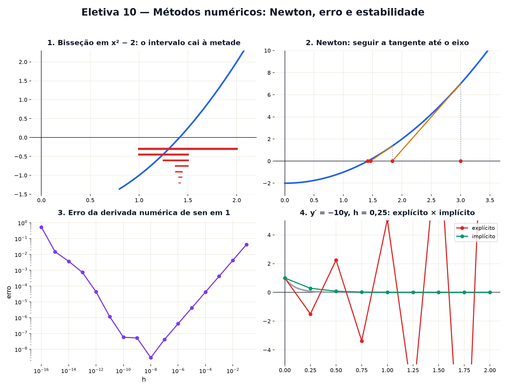

# Eletiva 10 — Métodos numéricos: Newton, erro e estabilidade

> Estas são as notas em texto da aula. A versão interativa, com os laboratórios e os exercícios
> que se corrigem sozinhos, está em [`index.html`](index.html).

*O computador não sabe resolver equação nenhuma: ele chuta, corrige e repete. Hoje você vê como os
chutes ficam certos em poucos passos — e como um computador pode errar feio fazendo contas
"exatas".*

**Você já sabe:** a derivada e a reta tangente (Aula 19), descer pelo gradiente (Aula 27), o método
de Euler e o passo grande que engana (Aula 28) e a raiz de uma equação do 2º grau (Aula 13). Hoje
eles viram as ferramentas que rodam dentro de todo software científico.

Resolver `x⁵ − x − 1 = 0` não tem fórmula. Integrar `e−x²` não tem fórmula. Prever o tempo não tem
fórmula. O que existe são **métodos numéricos**: receitas que chegam tão perto da resposta quanto se
queira. Mas o computador guarda só uns 16 dígitos de cada número, e cada conta perde um pouquinho. A
arte é chegar rápido *e* não deixar os errinhos crescerem.

> **🧠 Poder do cérebro**
>
> Você quer √2 sem calculadora. Chute 1,5 (1,5² = 2,25, grande demais). Agora faça a média entre 1,5
> e 2/1,5. Por que isso deveria chegar mais perto? Repita mais uma vez e confira quantas casas
> acertou.
>
> **Resposta:** Se x é grande demais, 2/x é pequeno demais — a raiz está entre eles, e a média fica
> mais perto. (1,5 + 1,333...)/2 = 1,41667; repetindo, 1,4142157 — já 5 casas certas (√2 =
> 1,4142136). Esse é o método babilônico, de 4.000 anos atrás, e é exatamente o método de Newton
> aplicado a x² − 2.

---

## Bisseção: cortar ao meio

Se uma função contínua é negativa em a e positiva em b, ela cruza o zero no meio (a curva não pula,
Aula 19). Olhe o ponto do meio: pelo sinal, você sabe em qual metade está o zero. Jogue a outra fora
e repita. Lento, mas **infalível**: cada passo divide o erro por 2.

> 🔧 **Laboratório — a bisseção acha √2.** A função é `f(x) = x² − 2`, começando no intervalo [1, 2].
> *(interativo, na versão em HTML)*

---

## O método de Newton

Newton usa a reta tangente (Aula 19): em vez da curva, onde é fácil achar o zero? Na reta! Do chute
x, siga a tangente até o eixo:

`x novo = x − f(x) / f′(x)`

Perto da resposta, o número de casas certas **dobra a cada passo**: 1, 2, 4, 8, 16. Em 5 ou 6
passos, o computador já não consegue guardar mais precisão.

> 🔧 **Laboratório — siga a tangente.** Escolha a equação e o chute inicial; cada clique dá um passo
> de Newton. *(interativo, na versão em HTML)*

**✅ Por que é verdade? As casas certas dobram**

1. Seja r a raiz e `e = x − r` o erro. Taylor (Eletiva 6) em volta de x: `0 = f(r) = f(x) − f′(x) ·
   e + ½ f″ · e² + ...`
2. Isolando: `x − f(x)/f′(x) − r = ½ (f″/f′) · e² + ...` O lado esquerdo é o erro do passo seguinte.
3. Então `erro novo ≈ C · erro²`. Se o erro é 10⁻³, o próximo é da ordem de 10⁻⁶, depois 10⁻¹²: as
   casas certas dobram. ∎ (Na bisseção, o erro só cai à metade: uma casa decimal a cada ~3,3
   passos.)

---

## Quando Newton se perde

A velocidade tem preço: Newton confia na tangente, e a tangente pode mentir. Onde `f′ ≈ 0`, a reta é
quase deitada e o próximo chute voa para longe. E há chutes que caem num **ciclo** eterno. Com `f(x)
= x³ − 2x + 2`, o chute 0 vai para 1, que volta para 0, para sempre — embora exista uma raiz perto
de −1,77.

> 🔧 **Laboratório — onde Newton se perde.** `f(x) = x³ − 2x + 2`. Escolha o chute e veja 25 passos.
> *(interativo, na versão em HTML)*

> 🧘 **O Guru:** Um bom método numérico é como um bom investigador: chuta com coragem, confere com
> humildade e desconfia de resultados bonitos demais. O computador faz bilhões de contas por
> segundo, e cada uma erra um pouquinho. Quem entende de onde vêm os erros decide se eles se
> cancelam ou se viram uma avalanche.

---

## O computador erra: arredondamento

O computador guarda números em binário com cerca de 16 dígitos significativos (o padrão IEEE 754).
Números como 0,1 nem têm representação exata em binário (como 1/3 em decimal). Resultado: `0,1 +
0,2` dá `0,30000000000000004`. E o erro aparece de verdade num exemplo clássico: a derivada numérica
`(f(x + h) − f(x)) / h`. Com h grande, a fórmula é grosseira; com h minúsculo, você subtrai dois
números quase iguais e perde os dígitos. Há um h ótimo no meio.

> 🔧 **Laboratório — o h ótimo da derivada.** Derivada de sen x em x = 1 (a certa é cos 1). Diminua h
> e acompanhe o erro, em escala logarítmica. *(interativo, na versão em HTML)*

---

## Cancelamento: a fórmula certa que dá errado

As raízes de `x² − b·x + 1 = 0` pela fórmula da Aula 13 são `(b ± √(b² − 4)) / 2`. Com b = 100
milhões, a raiz pequena é `(b − √(b² − 4)) / 2`: a diferença de dois números quase iguais — o
computador perde quase todos os dígitos (o **cancelamento catastrófico**). A cura é algébrica: como
o produto das raízes é 1, a pequena é `1 / (raiz grande)`, sem subtração nenhuma.

> 🔧 **Laboratório — duas fórmulas para a mesma raiz.** Aumente b e compare a raiz pequena pelas duas
> fórmulas com o valor verdadeiro (≈ 1/b). *(interativo, na versão em HTML)*

---

## Estabilidade: explícito × implícito

Na Aula 28, Euler anda com a inclinação do **começo** do passo (método **explícito**). No decaimento
rápido `y′ = −10y`, se o passo h passa de `2/10`, cada passo inverte e aumenta y: explode. O método
**implícito** usa a inclinação do **fim** do passo: `y novo = y − 10 h · y novo`, ou seja `y novo =
y / (1 + 10h)`. Mais conta por passo — mas ele nunca explode.

> 🔧 **Laboratório — o passo que explode.** `y′ = −10y`, com `y(0) = 1`. Cinza: a resposta exata
> `e−10t`. *(interativo, na versão em HTML)*

> **⚠️ Cuidado — nunca compare números de ponto flutuante com ==**
>
> Como `0,1 + 0,2 ≠ 0,3` no computador, teste "está perto o bastante" (`|a − b| < tolerância`). E
> para **dinheiro**, não use ponto flutuante: centavos somados milhões de vezes acumulam erro. Use
> aritmética decimal exata (como o `Decimal` do Python) ou inteiros em centavos, e arredonde com
> regra explícita.

### Não existe pergunta idiota

**P:** Se Newton é tão rápido, por que alguém usaria bisseção?

**R:** Porque a bisseção nunca falha (se o sinal troca, ela acha a raiz), e Newton pode se perder.
Os programas de verdade combinam os dois: começam com bisseção para chegar perto com segurança e
trocam para Newton para ganhar velocidade (o método de Brent faz isso).

**P:** Esses erros de arredondamento já causaram problemas reais?

**R:** Vários. Em 1991, um míssil Patriot errou o alvo porque um relógio somava 0,1 segundo em
binário, e o erro acumulado em 100 horas chegou a um terço de segundo. Em 1996, o foguete Ariane 5
explodiu por um número grande demais convertido para um formato pequeno.

---

## Pontos importantes

- **Bisseção**: corta ao meio pelo sinal; infalível, erro ÷ 2 por passo.
- **Newton**: `x − f/f′`; casas certas dobram por passo, mas pode se perder onde f′ ≈ 0.
- O computador guarda ~16 dígitos: **arredondamento**; há um h ótimo na derivada numérica.
- **Cancelamento**: subtrair números quase iguais perde dígitos; reescreva a fórmula.
- **Estabilidade**: Euler explícito explode com passo grande; o implícito não.

---

## ✏️ Afie o lápis

1. Começando com um intervalo de tamanho 1, quantos passos de bisseção, no mínimo, deixam o
   intervalo menor que 0,001? → **10**
2. Newton para `f(x) = x² − 2` (f′ = 2x), a partir de x = 1. Qual é o próximo chute? → **1,5**
3. Por que, no computador, `0,1 + 0,2` não dá exatamente 0,3? → **Porque 0,1 e 0,2 não têm
   representação exata em binário; guardam-se aproximações, e os errinhos aparecem na soma.**
4. Perto da raiz, o que acontece com o número de casas decimais certas a cada passo de Newton? →
   **Mais ou menos dobra.**
5. *(o desafio)* Euler explícito em `y′ = −10y`: cada passo faz `y novo = (1 − 10h) · y`. Qual é
   o maior passo h com o qual y não cresce (|1 − 10h| ≤ 1)? → **0,2**
6. *(quem faz o quê?)* Ligue cada peça ao seu papel. → **bisseção → corta o intervalo ao meio
   pelo sinal; método de Newton → segue a tangente até o zero; erro de arredondamento → o computador
   guarda só uns 16 dígitos; instabilidade → pequenos erros crescem a cada passo**
